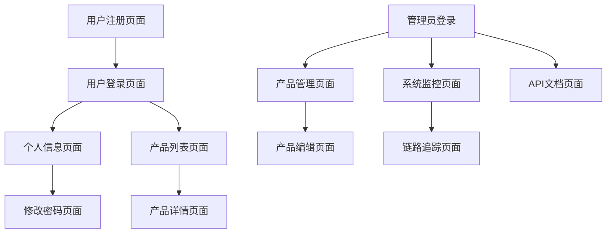

# Play Go API 产品需求文档

## 1. Product Overview

Play Go API 是一个基于Go语言的现代化RESTful API服务平台，为开发者提供完整的后端API解决方案。该项目集成了用户管理、产品管理等核心业务功能，并配备了完善的监控、追踪和部署体系。

项目主要解决企业级API服务开发中的通用需求，包括用户认证授权、数据管理、性能监控等问题。目标用户包括后端开发者、系统架构师和运维工程师。

该产品旨在成为Go语言微服务开发的最佳实践示例，展示现代化云原生应用的完整技术栈。

## 2. Core Features

### 2.1 User Roles

| Role | Registration Method | Core Permissions |
|------|---------------------|------------------|
| 普通用户 | 邮箱注册 | 可以注册账号、登录系统、查看和修改个人信息 |
| 管理员 | 系统分配 | 拥有所有用户权限，可以管理产品信息、查看系统监控数据 |

### 2.2 Feature Module

我们的API服务包含以下主要功能模块：

1. **用户管理页面**: 用户注册、登录认证、个人信息管理
2. **产品管理页面**: 产品信息CRUD操作、库存管理
3. **系统监控页面**: 性能指标展示、追踪数据可视化
4. **API文档页面**: 接口文档展示、在线测试工具

### 2.3 Page Details

| Page Name | Module Name | Feature description |
|-----------|-------------|---------------------|
| 用户管理页面 | 用户注册模块 | 提供用户名、邮箱、密码注册功能，支持数据验证和重复检查 |
| 用户管理页面 | 用户登录模块 | JWT令牌认证，支持用户名/邮箱登录，自动令牌刷新 |
| 用户管理页面 | 个人信息模块 | 查看和编辑用户基本信息，支持头像上传和密码修改 |
| 产品管理页面 | 产品列表模块 | 分页展示产品信息，支持搜索、筛选和排序功能 |
| 产品管理页面 | 产品编辑模块 | 创建和编辑产品信息，包括名称、描述、价格、库存管理 |
| 产品管理页面 | 库存管理模块 | 实时库存监控，库存预警和自动补货提醒 |
| 系统监控页面 | 性能监控模块 | 展示API响应时间、请求量、错误率等关键指标 |
| 系统监控页面 | 链路追踪模块 | 可视化请求链路，定位性能瓶颈和错误源头 |
| API文档页面 | 接口文档模块 | 自动生成的API文档，支持在线测试和代码示例 |

## 3. Core Process

### 普通用户流程
用户首先通过注册页面创建账号，填写用户名、邮箱和密码。注册成功后跳转到登录页面进行身份验证，获取JWT令牌。登录后可以访问个人信息页面查看和修改基本资料，也可以浏览产品列表页面查看可用产品信息。

### 管理员流程
管理员通过系统分配的账号登录后，除了拥有普通用户的所有权限外，还可以访问产品管理页面进行产品的增删改查操作，管理库存信息。同时可以访问系统监控页面查看API性能指标和链路追踪数据，确保系统稳定运行。

## 4. User Interface Design

### 4.1 Design Style

- **主色调**: 蓝色系 (#2563EB) 作为主色，灰色系 (#6B7280) 作为辅助色
- **按钮样式**: 圆角按钮设计，主要按钮采用渐变效果
- **字体**: 系统默认字体，标题使用16-20px，正文使用14px
- **布局风格**: 卡片式布局，顶部导航栏设计
- **图标风格**: 使用简洁的线性图标，支持主题色彩适配

### 4.2 Page Design Overview

| Page Name | Module Name | UI Elements |
|-----------|-------------|-------------|
| 用户管理页面 | 用户注册模块 | 居中卡片布局，白色背景，蓝色主按钮，表单验证提示采用红色文字 |
| 用户管理页面 | 用户登录模块 | 简洁登录表单，记住密码选项，社交登录按钮组 |
| 产品管理页面 | 产品列表模块 | 表格布局，搜索框，分页组件，操作按钮组采用不同颜色区分 |
| 系统监控页面 | 性能监控模块 | 仪表盘布局，图表组件，实时数据更新，响应式网格系统 |
| API文档页面 | 接口文档模块 | 左侧导航树，右侧内容区，代码高亮显示，在线测试面板 |

### 4.3 Responsiveness

项目采用桌面优先的响应式设计，支持移动端适配。在移动设备上，导航栏会折叠为汉堡菜单，表格会转换为卡片式布局，确保在各种屏幕尺寸下都有良好的用户体验。同时优化了触摸交互，增大了按钮点击区域。
