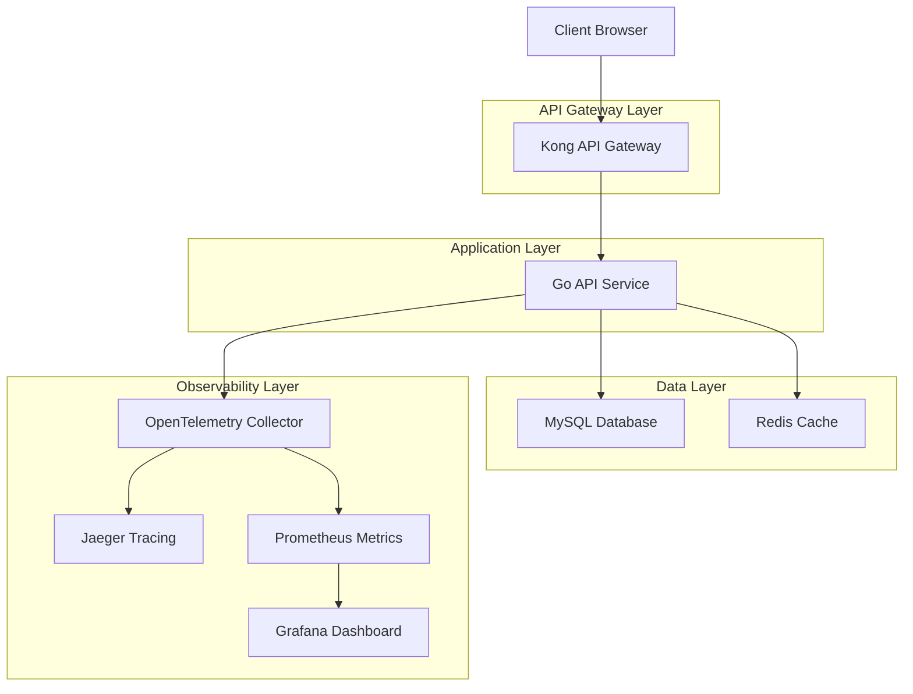
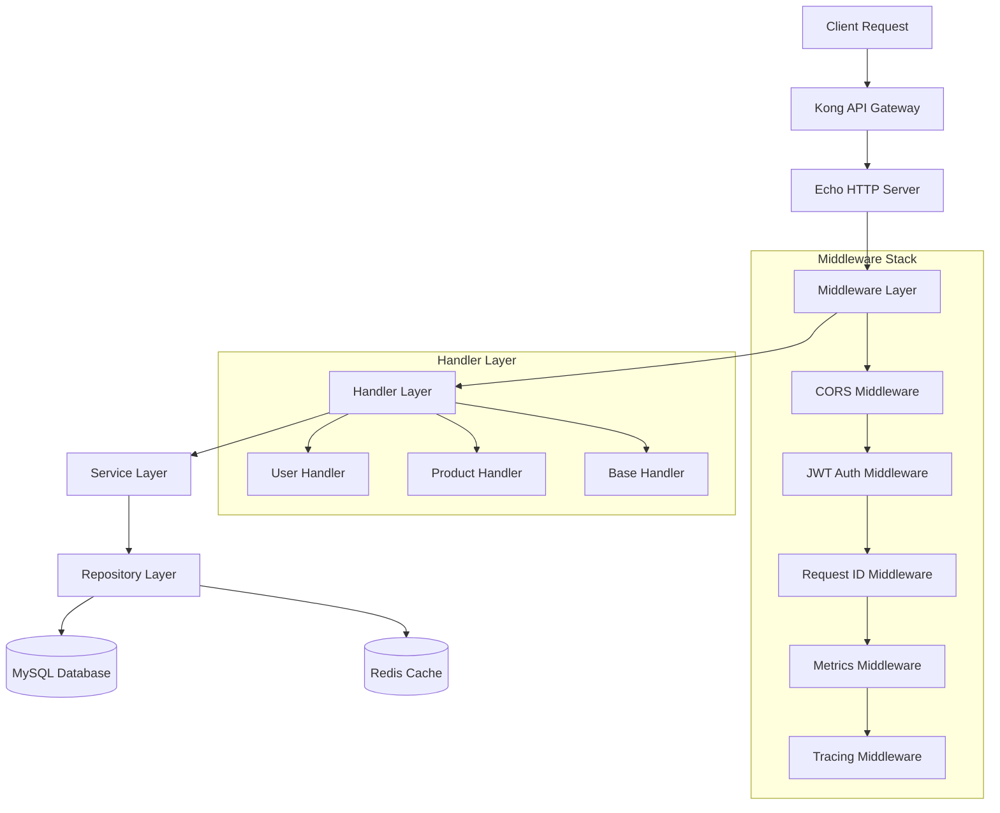
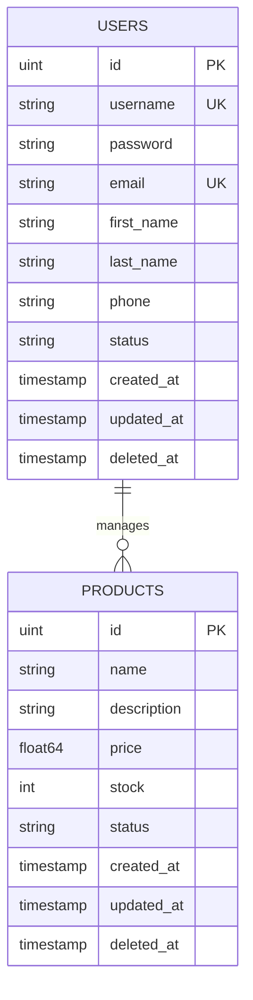

# Play Go API 技术架构文档

## 1. Architecture design



## 2. Technology Description

- Frontend: Swagger UI + ReDoc (API文档展示)
- Backend: Go@1.24 + Echo@4.13 + GORM@1.25
- Database: MySQL@8.0
- Cache: Redis@7
- API Gateway: Kong@3.9
- Monitoring: Prometheus@2.50 + Grafana@10.3
- Tracing: OpenTelemetry + Jaeger@1.54
- Container: Docker + Docker Compose

## 3. Route definitions

| Route | Purpose |
|-------|----------|
| /health | 健康检查端点，返回服务状态信息 |
| /metrics | Prometheus指标收集端点 |
| /api/v1/register | 用户注册接口 |
| /api/v1/login | 用户登录接口 |
| /api/v1/users/current | 获取当前用户信息 |
| /api/v1/users/:id | 用户信息CRUD操作 |
| /api/v1/products | 产品列表和创建接口 |
| /api/v1/products/:id | 产品详情和管理接口 |

## 4. API definitions

### 4.1 Core API

用户认证相关接口

```
POST /api/v1/register
```

Request:
| Param Name | Param Type | isRequired | Description |
|------------|------------|------------|-------------|
| username | string | true | 用户名，唯一标识 |
| password | string | true | 用户密码 |
| email | string | true | 用户邮箱地址 |
| first_name | string | false | 用户名字 |
| last_name | string | false | 用户姓氏 |
| phone | string | false | 用户手机号 |

Response:
| Param Name | Param Type | Description |
|------------|------------|-------------|
| id | uint | 用户ID |
| username | string | 用户名 |
| email | string | 用户邮箱 |
| status | string | 用户状态 |

Example:
```json
{
  "username": "john_doe",
  "password": "secure_password",
  "email": "john@example.com",
  "first_name": "John",
  "last_name": "Doe"
}
```

```
POST /api/v1/login
```

Request:
| Param Name | Param Type | isRequired | Description |
|------------|------------|------------|-------------|
| username | string | true | 用户名或邮箱 |
| password | string | true | 用户密码 |

Response:
| Param Name | Param Type | Description |
|------------|------------|-------------|
| token | string | JWT访问令牌 |
| user | object | 用户基本信息 |

产品管理相关接口

```
GET /api/v1/products
```

Query Parameters:
| Param Name | Param Type | isRequired | Description |
|------------|------------|------------|-------------|
| include_deleted | boolean | false | 是否包含已删除的产品 |

Response:
| Param Name | Param Type | Description |
|------------|------------|-------------|
| products | array | 产品列表 |

```
POST /api/v1/products
```

Request:
| Param Name | Param Type | isRequired | Description |
|------------|------------|------------|-------------|
| name | string | true | 产品名称 |
| description | string | false | 产品描述 |
| price | float64 | true | 产品价格 |
| stock | int | true | 库存数量 |

## 5. Server architecture diagram



## 6. Data model

### 6.1 Data model definition



### 6.2 Data Definition Language

用户表 (users)
```sql
-- create table
CREATE TABLE users (
    id INT UNSIGNED AUTO_INCREMENT PRIMARY KEY,
    username VARCHAR(255) UNIQUE NOT NULL,
    password VARCHAR(255) NOT NULL,
    email VARCHAR(255) UNIQUE NOT NULL,
    first_name VARCHAR(100),
    last_name VARCHAR(100),
    phone VARCHAR(20),
    status VARCHAR(20) DEFAULT 'active',
    created_at TIMESTAMP DEFAULT CURRENT_TIMESTAMP,
    updated_at TIMESTAMP DEFAULT CURRENT_TIMESTAMP ON UPDATE CURRENT_TIMESTAMP,
    deleted_at TIMESTAMP NULL,
    INDEX idx_users_username (username),
    INDEX idx_users_email (email),
    INDEX idx_users_deleted_at (deleted_at)
);

-- init data
INSERT INTO users (username, password, email, first_name, last_name, status) VALUES
('admin', '$2a$10$example_hashed_password', 'admin@example.com', 'Admin', 'User', 'active'),
('john_doe', '$2a$10$example_hashed_password', 'john@example.com', 'John', 'Doe', 'active');
```

产品表 (products)
```sql
-- create table
CREATE TABLE products (
    id INT UNSIGNED AUTO_INCREMENT PRIMARY KEY,
    name VARCHAR(255) NOT NULL,
    description TEXT,
    price DECIMAL(10,2) NOT NULL,
    stock INT NOT NULL DEFAULT 0,
    status VARCHAR(20) DEFAULT 'active',
    created_at TIMESTAMP DEFAULT CURRENT_TIMESTAMP,
    updated_at TIMESTAMP DEFAULT CURRENT_TIMESTAMP ON UPDATE CURRENT_TIMESTAMP,
    deleted_at TIMESTAMP NULL,
    INDEX idx_products_name (name),
    INDEX idx_products_status (status),
    INDEX idx_products_deleted_at (deleted_at)
);

-- init data
INSERT INTO products (name, description, price, stock, status) VALUES
('示例产品1', '这是一个示例产品的描述', 99.99, 100, 'active'),
('示例产品2', '另一个示例产品', 149.99, 50, 'active'),
('示例产品3', '第三个示例产品', 199.99, 25, 'active');
```
